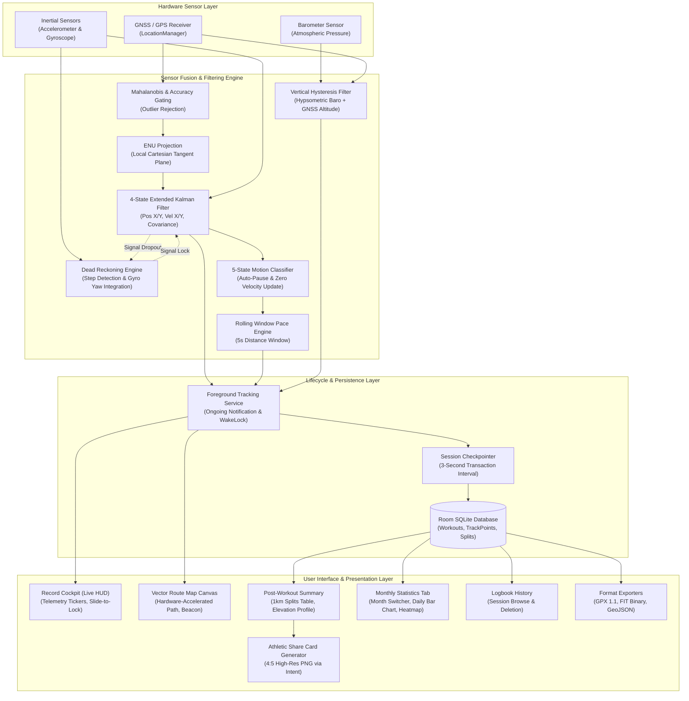

# Open-Source Strava (Apex)

Apex is an offline athletic activity tracker for Android designed for runners, cyclists, hikers, and walkers. It operates entirely on-device with zero account requirements, zero cloud dependencies, and zero background analytics.

[](https://github.com/IUIKong/apex/releases/latest/download/Apex.apk)
[](https://github.com/IUIKong/apex/releases/latest)

---

## Features

### 1. Real-Time Live HUD & Cockpit
- **Glanceable Telemetry**: Displays distance, current rolling pace, moving duration, average pace, cadence, and vertical elevation gain.
- **Split Pacing Ticker**: Real-time ticker tracks progress toward the next 1.0 km milestone and reports live delta against overall average pace.
- **Slide-to-Lock Guard**: Full-travel horizontal slider locks the display to prevent accidental pocket or sweat taps during intense activity.
- **Tactile Audio & Haptics**: Subtle system click tones accompany tactical button interactions (Start, Pause, Resume, Finish) without playing audio during tracking.

### 2. Interactive Route Vector Canvas
- **Hardware-Accelerated Path**: Live polyline rendering with high-contrast Obsidian/Cyan palettes.
- **Anchored Location Beacon**: Pulsing concentric beacon tracks real-time coordinates and direction of travel without separation or erratic rotation.
- **Multi-Touch Gestures**: Smooth pan, pinch-to-zoom, auto-follow toggle, and instant re-centering.

### 3. Post-Workout Summary & Interval Splits
- **Comprehensive Summary**: Overview of total distance, elapsed time, active moving time, average pace, maximum pace, elevation gain, and burned energy.
- **1.0 km Interval Splits Table**: Detailed breakdown per kilometer displaying split pace, split duration, elevation gain per interval, and ahead/behind color coding against the workout average.
- **Elevation Profile**: Interactive elevation profile canvas with min/max altitude markers, gradient fills, and elevation range lines.

### 4. Monthly Statistics & Daily History
- **Interactive Month Navigation**: Review performance by month with previous/next controls and instant jump to the current period.
- **Monthly Summary Cards**: Aggregated metrics for total monthly distance, active moving duration, completed sessions, cumulative elevation gain, and monthly average pace.
- **Daily Distance Distribution Bar Chart**: Interactive bar chart displaying distance per day across the selected month. Tapping any bar highlights that day and updates the detailed breakdown.
- **Training Heatmap Matrix**: Calendar grid visualization highlighting active workout days.
- **Daily Workout Drilldown**: Detailed workout session cards for any selected day with direct tap-to-review navigation.

### 5. Activity Logbook & Multi-Format Exporter
- **Offline Logbook**: Chronological workout history stored locally on-device.
- **Standardized File Exports**: Direct export to GPX 1.1, Garmin FIT binary, and GeoJSON (RFC 7946) formats for compatibility with external fitness platforms and GIS software.
- **Workout Deletion & Management**: Manage and clean stored sessions directly within the app.

### 6. Athletic Workout Share Card
- **High-Resolution Card Generation**: Generates a 4:5 aspect ratio summary card with custom route map graphics, date, distance, moving time, pace, and elevation gain.
- **Direct System Sharing**: Shares the generated image directly to WhatsApp, Instagram, Telegram, or any installed messaging app via Android's native share sheet.

### 7. Background Service & Crash Resilience
- **Foreground Tracking Service**: Persistent notification with live telemetry counters and interactive Pause, Resume, and Finish actions.
- **Partial WakeLock Management**: Keeps GNSS polling and sensor updates active while the screen is powered off.
- **Session Checkpointing**: Periodically flushes filter state, coordinates, accumulators, and split times to an on-device SQLite database every 3 seconds. Unplanned process terminations or system shutdowns restore losslessly on the next app launch.

### 8. Customization & Update Engine
- **In-App Settings**: Configurable intro animation playback behavior and background update checker toggles.
- **Automated Update Checker**: Checks GitHub Releases for new APK versions and notifies the user with direct download access when updates are available.

---

## How It Works

Apex combines raw satellite positioning with inertial sensors through on-device state estimation and dead reckoning to provide accurate distance, pace, and elevation data.

### 1. GNSS Gating & Coordinate Projection
Raw satellite fixes pass through accuracy and speed gating. Measurements with high horizontal dilution of precision or unrealistic speed deltas are filtered out. Valid coordinates are projected into an East-North-Up (ENU) Cartesian frame centered at the workout start origin. This avoids spherical trigonometry distortion during distance calculations.

### 2. Extended Kalman Filter (EKF) & Dead Reckoning
An Extended Kalman Filter fuses ENU coordinates with accelerometer and gyroscope sensor streams. The filter models positions and velocities to suppress GPS multipath errors, atmospheric interference, and stationary GPS drift (artificial distance accumulation while standing still). 

When satellite visibility drops in tunnels, dense urban streets, or heavy tree cover, the dead reckoning engine bridges the gap using step detection, cadence estimation, and gyroscope yaw integration. When satellite fixes return, the filter smoothly re-anchors without sudden coordinate jumps.

### 3. Motion State Classification & Rolling Pace
A 5-state motion classifier tracks movement status (`INITIALIZING`, `MOVING`, `POSSIBLY_STOPPED`, `STOPPED`, `POSSIBLY_MOVING`). This classifies traffic light stops, pedestrian crossings, and brief breaks to prevent paused time from distorting active moving pace. Instantaneous pace is computed using a rolling 5-second sliding distance window, providing responsive pace figures that avoid stride jitter.

### 4. Barometric & GNSS Vertical Fusion
Vertical altitude blends atmospheric pressure measurements from the onboard barometer with vertical GNSS altitude. A vertical hysteresis filter eliminates micro-fluctuations caused by wind gusts, indoor airflow, or pocket pressure variations, recording genuine climbs and descents without artificial gain.

### 5. Local Storage & Checkpointing
Every 3 seconds, the tracking service checkpoints the full EKF state, active split records, coordinate history, and moving counters to a local SQLite database via Room. When an activity finishes, checkpoints are committed to finalized workout records and trackpoint lists, with export formats generated on demand.

---

## Architecture Flowchart



---

## Technical Specifications

| Parameter | Specification |
| :--- | :--- |
| **Minimum Android Version** | Android 8.0 (API Level 26) |
| **Target Android Version** | Android 15 (API Level 35) |
| **Primary Sensors** | GPS / GNSS, 3-Axis Accelerometer, 3-Axis Gyroscope |
| **Optional Sensors** | Atmospheric Barometer, Step Detector |
| **Coordinate Projection** | Local East-North-Up (ENU) tangent plane |
| **State Estimation** | 4-state Extended Kalman Filter with zero-velocity updates |
| **Checkpoint Interval** | 3.0 seconds |
| **Database Engine** | SQLite via Android Jetpack Room |
| **Export Standards** | GPX 1.1, Garmin FIT Binary, GeoJSON (RFC 7946) |
| **UI Framework** | Jetpack Compose (Material3 + Custom Obsidian Tokens) |

---

## Building from Source

### Prerequisites
- JDK 17
- Android SDK 35
- Gradle 8.11.1 (included via wrapper)

### Build Debug APK
```bash
git clone https://github.com/IUIKong/apex.git
cd apex
./gradlew assembleDebug
```
The output file is located at `app/build/outputs/apk/debug/app-debug.apk`.

### Build Release APK
```bash
./gradlew assembleRelease
```
The output file is located at `app/build/outputs/apk/release/app-release.apk`.

### Run Unit Tests
```bash
./gradlew testDebugUnitTest
```
