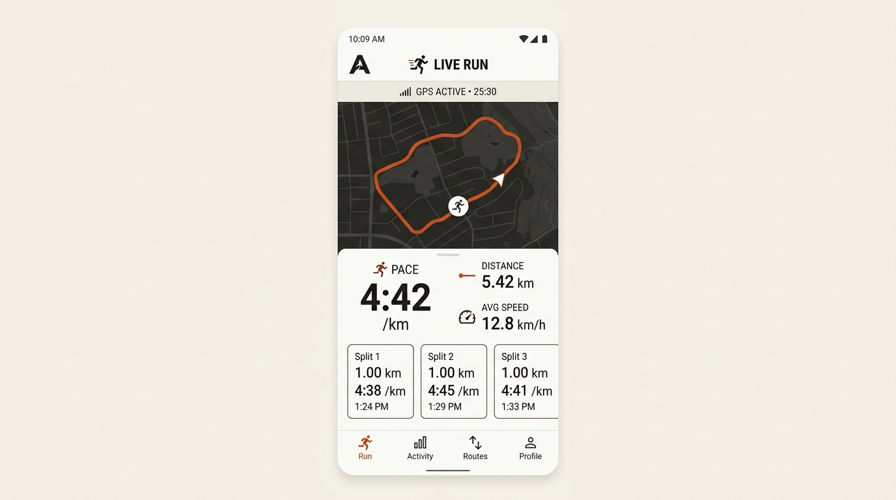

# Apex

Apex is an offline athletic activity tracker for Android designed for runners, cyclists, hikers, and walkers. It operates entirely on-device with zero account requirements, zero cloud dependencies, and zero background analytics.

[](https://github.com/IUIKong/apex/releases/latest/download/Apex.apk)
[](https://github.com/IUIKong/apex/releases/latest)



---

## How It Works

Apex pairs on-device GPS with hardware motion sensors through an onboard mathematical filter to deliver stable distance, pacing, and elevation metrics in real time.

### 1. Sensor Fusion & Distance Tracking
- **Extended Kalman Filter (EKF)**: Blends raw GNSS coordinate fixes with linear accelerometer and gyroscope data. This suppresses GPS multipath reflections, GPS jitter in urban canyons, and stationary GPS drift (the artificial distance accumulation that occurs when standing still).
- **Dead Reckoning Extrapolation**: When satellite reception is temporarily lost (such as passing under bridges, through tunnels, or along heavily forested paths), Apex bridges the gap using step detection and gyroscope yaw integration before smoothly re-anchoring when satellite lock returns.
- **Local Tangent Coordinate Projection**: Coordinates are converted into an East-North-Up (ENU) Cartesian frame centered at the workout start origin for high-precision local arithmetic without spherical distortion.

### 2. Pacing & Auto-Pause
- **Rolling Pace Smoothing**: Rather than displaying raw, erratic point-to-point speed, current pace is computed across a 5-second sliding distance window and updated at 5-second intervals. This produces a readable min/km metric that responds to genuine accelerations without fluttering on every stride.
- **5-State Motion Classifier**: Distinguishes between moving, slowing down, stopped, and resuming (`INITIALIZING`, `MOVING`, `POSSIBLY_STOPPED`, `STOPPED`, `POSSIBLY_MOVING`). It prevents traffic light stops and water breaks from skewing moving pace while ignoring brief pauses under 3 seconds.

### 3. Vertical Elevation Profiling
- **Barometer & GNSS Fusion**: Combines atmospheric pressure readings (using the standard hypsometric formula) with vertical GNSS altitude.
- **Hysteresis Deadband**: Rejects micro-fluctuations caused by wind gusts, indoor HVAC currents, and pocket pressure changes, capturing genuine climbs and descents without artificial gain accumulation.

### 4. Background Execution & Crash Resilience
- **Foreground Service**: Runs as a prioritized Android foreground service with a persistent notification displaying live distance, moving time, and current pace, alongside Pause/Resume and Finish actions.
- **WakeLock Management**: Uses a managed partial wake lock to keep sensor polling active during screen-off sleep.
- **Session Checkpointing**: Writes active workout telemetry and filter states to an on-device SQLite database every 3 seconds. If the application process is terminated by the operating system or the battery dies, the session can be resumed on next launch. Sessions shorter than 5 seconds are discarded automatically.

### 5. Visuals & Interaction
- **Flat Beige Palette**: Clean warm alabaster/beige background (`#FBFBF9`) with zero card elevations or drop shadows.
- **Vector Route Map**: Hardware-accelerated canvas that plots recorded coordinates in real time, featuring an anchored location beacon, directional heading, pinch-to-zoom, pan gestures, and auto-follow tracking.
- **Slide-to-Lock**: A full-travel horizontal slider prevents accidental screen touches from sweat or clothing during intense movement.
- **Tactile Audio Feedback**: Subtle, non-intrusive system click tones accompany interactive button presses without playing audio during tracking or sensor updates.
- **Workout Sharing**: Exports an athletic 4:5 summary card rendered directly to a high-resolution PNG, complete with the route path, pace, distance, time, and elevation gain for sharing via the system share sheet.

---

## App Architecture

```
com.apex.tracker
├── core
│   ├── fusion         # EKF estimator, pace engine, distance accumulators, hysteresis filter
│   ├── math           # ENU projection, Haversine, 4x4 matrix operations
│   └── model          # Fused state, motion states, checkpoints, split records
├── database           # Room database, workout DAOs, checkpoint store, recovery manager
├── sensor             # LocationManager, SensorManager listeners, satellite status
├── service            # Foreground tracking service, notification manager, wake lock
├── ui
│   ├── components     # Tactical controls bar, slide-to-lock, telemetry grid, route canvas
│   ├── live           # Real-time HUD recording screen
│   ├── summary        # Post-workout breakdown, splits table, share card generator
│   ├── history        # Offline workout logbook and activity review
│   ├── splash         # Intro animation sequence
│   └── theme          # Color tokens, typography, dimensions
└── export             # Local activity data formatting
```

---

## Requirements

- Android 8.0 (API level 26) or higher
- Device with hardware GPS / GNSS
- Accelerometer and gyroscope (Barometer supported for enhanced elevation tracking)

---

## Building

Clone the repository and compile using the Gradle wrapper:

```bash
git clone https://github.com/IUIKong/apex.git
cd apex
./gradlew assembleDebug
```

The output APK will be generated at:
```
app/build/outputs/apk/debug/app-debug.apk
```

To run the unit test suite:

```bash
./gradlew testDebugUnitTest
```
